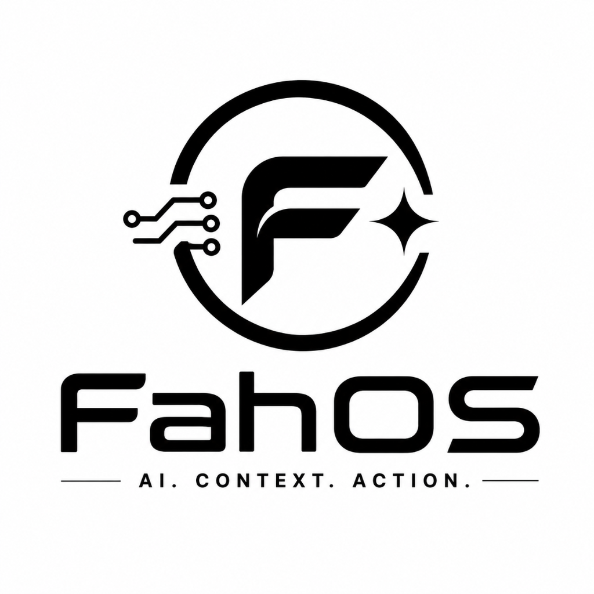

<div align="center">



# FahOS
### The Voice-First AI Operating Layer for Windows

[](https://microsoft.com/windows)
[](https://electronjs.org)
[](https://ai.google.dev)
[](https://groq.com)
[](LICENSE)

<br/>

> **FahOS** turns your Windows PC into a conversational AI operating environment.  
> Speak naturally or type commands — FahOS hears, perceives, and executes actions directly on your desktop.

</div>

---

## 📌 Executive Summary

Modern desktop operating systems remain tied to manual paradigms developed thirty years ago: navigating nested menus, juggling application windows, and repetitive mouse clicks. While Large Language Models (LLMs) have mastered conversational intelligence, they remain trapped inside web chat windows.

**FahOS bridges the "last mile"** — collapsing the gap between natural human intent and native OS execution. By combining high-speed voice transcription, a 5-tier multi-model reasoning matrix, and native Windows automation, FahOS gives AI actual hands to control your PC.

---

## ✨ Features Implemented (Current Build)

### 🎙️ Dual-Engine Voice Pipeline
- **Real-Time 16kHz Resampling**: Captures microphone input via Web Audio API and resamples 48kHz stereo to 16kHz mono PCM Float32 samples in-memory using `OfflineAudioContext`.
- **Groq Cloud Whisper**: Sub-300ms speech-to-text powered by `whisper-large-v3-turbo` with dynamic RIFF WAV header synthesis.
- **Offline ONNX Fallback**: Local browser/device speech recognition via `@xenova/transformers` ensures uninterrupted transcription even without an active internet connection.

### 🧠 5-Tier AI Orchestrator & Intent Router
- **Multi-Provider Failover Matrix**: Seamless cascading failover across **Google Gemini 3.6 Flash**, **Groq (Qwen 3.8 / GPT-OSS)**, and local **Ollama** models.
- **Complexity Tier Classification**: Classifies queries into 5 specialized tiers (Simple, Medium, Complex, Coding, and Vision) to balance latency and computational depth.
- **Live Web Grounding**: Injects real-time DuckDuckGo and Wikipedia search snippets for temporal and current-event queries.

### ⚡ Native Windows OS & Filesystem Actions
- **CRUD Filesystem Agent**: Natural language creation, reading, directory listing, and safe deletion across Desktop, Documents, and Downloads (`systemActions.js`).
- **Dynamic Start Menu Scanner**: Deep search indexing of installed Windows applications and shortcuts for instant voice-activated app launching.
- **Media & System Controls**: Voice-driven volume adjustment, track skipping, and instant workstation locking.

### 🛡️ 3-Tier Security Guard
To prevent accidental data loss, every action passes through an auditable security boundary:
- 🟢 **SAFE**: Reading files, listing directories, launching apps, answering questions (executes immediately).
- 🟡 **CONFIRM**: Creating files, composing draft emails (shows preview first).
- 🔴 **DANGEROUS**: Deleting files or directories (blocked until explicit `"confirm delete..."` command).

### 💾 Local-First Contacts & History Store
- **Private Conversation History**: Rolling 200-entry conversation log stored locally in `fahos_history.json`. 100% private — zero cloud storage.
- **Smart Contacts Directory**: Local address book supporting one-touch deep-link messaging via WhatsApp and Gmail.

### 🪟 Obsidian Glass HUD
- **Floating Frameless Window**: Obsidian glassmorphic overlay with top slide-down summon animation.
- **Global Hotkeys**: Instant access via `Ctrl + Space` or `Alt + Space`.
- **Zero-Flicker Dragging**: Native OS-level smooth repositioning and vertical expansion.

---

## 🔮 Upcoming & Planned Features (Next Hackathon Sprints)

The following capabilities are actively planned in our progressive roadmap:

### 1. 👁️ Ephemeral Screen Perception & Gemini Vision (Next Up)
- **In-Memory GDI Desktop Capture**: Ephemeral screen frame acquisition without touching disk storage.
- **Spatial UI Element Grounding**: Gemini Multimodal Vision identifies target buttons, menus, and form coordinates from plain English requests.
- **Native P/Invoke Cursor Control**: C# mouse event synthesis to physically move the Windows cursor and click UI elements.
- **Interactive Screen Region Snipper**: Lightweight cropping tool to visually ask questions about specific portions of the screen.

### 2. 🌐 Autonomous Playwright Web Agent
- **FastAPI Python Microservice**: Standalone headless browser automation backend.
- **Persistent Chrome Session**: Executes multi-step web workflows while retaining user cookies and authenticated states.
- **Embedded Agent Browser View**: Live view of automated browser navigation embedded directly inside the FahOS interface.

### 3. 🧪 Full Edge-Case Test Suite & Architecture Docs
- **Jest Test Coverage**: Over 100 automated test suites covering audio decoding, intent classification, and multi-model failover chains.
- **System Architecture Whitepaper**: Deep-dive component diagrams and execution flow documentation.

---

## 🛠️ Quick Start & Demo Setup

### Prerequisites
- **Node.js**: v18.0.0 or higher
- **OS**: Windows 10 / 11

### 1. Installation
```bash
git clone https://github.com/akhilgandloji789/FahOS.git
cd FahOS
npm install
```

### 2. Configuration
Copy the template configuration file:
```bash
copy fahos.config.example.json fahos.config.json
```
*(Open `fahos.config.json` to insert your free Gemini or Groq API keys).*

### 3. Launch
Run via npm or double-click the one-click batch script:
```bash
npm start
# OR double-click:
run-fahos.bat
```

Press **`Ctrl + Space`** or **`Alt + Space`** to summon the FahOS overlay from anywhere in Windows.

---

## 💡 Example Voice Commands to Try

| Category | Example Command | Expected Behavior |
|:---|:---|:---|
| **Filesystem CRUD** | *"Create project_notes.txt in downloads"* | Creates file in `Downloads` and displays confirmation card. |
| **Directory Inspection** | *"List files in downloads"* | Reads and formats directory contents in HUD. |
| **File Reading** | *"Read project_notes.txt from downloads"* | Displays file contents in markdown view. |
| **Safety Guard** | *"Delete project_notes.txt from downloads"* | **Blocked** by security guard; prompts for explicit confirmation. |
| **App Control** | *"Open Calculator"* / *"Launch Notepad"* | Indexes Start Menu and starts application. |
| **Media** | *"Volume up"* / *"Mute audio"* / *"Lock PC"* | Triggers native Windows system controls. |
| **Reasoning & AI** | *"Explain quantum computing simply"* | Dynamically routes query to optimal AI tier. |

---

## 📄 License
MIT License. Built with precision for the hackathon.
